# ¿Qué es Indira Ris?

Un sistema de información radiológica (RIS) es un sistema de software en red para gestionar imágenes médicas y datos asociados. Un RIS es especialmente útil para rastrear pedidos de imágenes de radiología e información de facturación, y a menudo se usa junto con sistemas de comunicación y archivo de imágenes (PACS) y archivos neutrales del proveedor (VNA) para administrar archivos de imágenes, facturación de registros y registros médicos electrónicos (EHR).

## Tabla de Contenido

1. [Introducción](#introducción)
2. [Prerrequisitos](#prerrequisitos)
3. [Comenzamos](#comenzamos)
   
   3.1 [Instalación de Visual Studio](#instalación-de-visual-studio)
   
   3.2 [Descarga e instalación de GIT](#descarga-e-instalación-de-git)
   
   3.3 [Descarga e instalación de Azure CLI](#descarga-e-instalación-de-azure-cli)
   
   3.4 [Agregación de la extensión Azure DevOps](#agregación-de-la-extensión-azure-devops)
   
   3.5 [Activación de IIS (Administrador de Internet Information Services)](#activación-de-iis-administrador-de-internet-information-services)
   
4. [Clonación del repositorio del Ris](#ahora-procedemos-a-clonar-el-repositorio-del-ris)
   
5. [Configuración de nuestro proyecto de servicios (Back-End) en Visual Studio](#configuración-de-nuestro-proyecto-de-servicios-back-end-en-visual-studio)
   
   5.1 [Abrir Visual Studio en modo administrador](#1-abrimos-visual-studio-en-modo-administrador)
   
6. [Configurando nuestro IIS](#configurando-nuestro-iis)
7. 
   6.1 [Crear un nuevo sitio en IIS](#1-crear-un-nuevo-sitio-en-iis)
   
   6.2 [Crear una aplicación dentro del sitio en IIS](#2-crear-una-aplicación-dentro-del-sitio-en-iis)
   
   6.3 [Configuración de enlace https](#3-configuración-de-enlace-https)
   
8. [Validación del servicio](#ya-tenemos-el-iis-configurado-pero-cómo-sabemos-que-nuestro-servicio-funciona)
   
9. [Configuración de nuestro proyecto de la página web (Front-End) en Visual Studio](#configuración-de-nuestro-proyecto-de-la-página-web-front-end-en-visual-studio)

## Introducción

A continuación, le mostraremos como descargar e instalar las herramientas necesarias para obtener nuestra solución de Indira Ris, también a cómo configurar nuestro sitio de servicios donde se alojarán los webs services del RIS.

## Prerrequisitos

* [.NET](https://docs.microsoft.com/es-es/dotnet/fundamentals/) - Framework gratuito y de código abierto para los sistemas operativos Windows, Linux y macOS. Es un sucesor multiplataforma de .NET Framework. Se usa la versión 2.2. [Enlace de Descarga](https://versionsof.net/core/2.2/2.2.8/) 
* DevExpress - herramienta que ofrece unas de las suits más completas de componentes de interfaz de usuario (UI) en todas las plataformas .NET tales como Windows Forms, MVC, ASP.NET, Silverlight y Windows XAML. Se usa la versión 20.1.8

## Comenzamos

Para esto debemos descargar el IDE el cual usaremos, llamado [**Visual Studio**](https://visualstudio.microsoft.com/es/downloads/, "Enlace de descarga") en la versión 2022. Luego realizaremos los siguientes pasos:

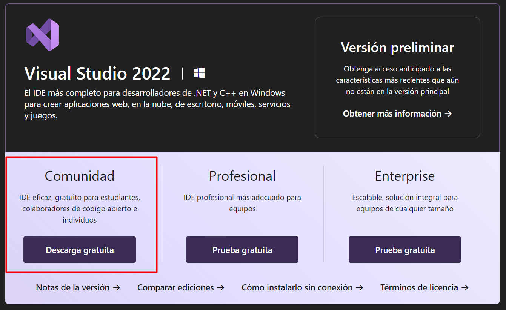

> ## Instalación de Visual Studio

Cuando estemos en los pasos de instalación, tener en cuenta estas opciones:

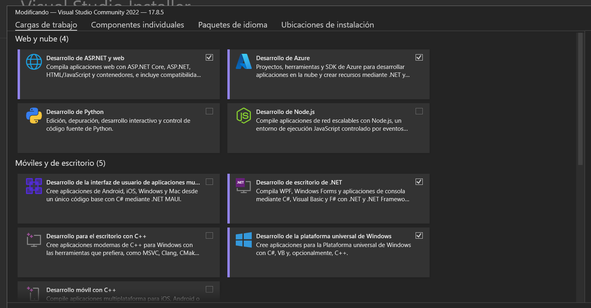

**Nota: Importante siempre ejecutar el visual en modo administrador**

> ## Descarga e instalación de GIT

Git es una herramienta que usaremos para el control de versionamiento de producto, para descargarla damos clic [Aquí](https://git-scm.com/download/win) y seguimos los pasos del instalador.  

> ## Descarga e instalación de Azure CLI

Después de descargar GIT, procedemos con Azure CLI. Para ello damos clic [Aquí](https://docs.microsoft.com/en-us/cli/azure/install-azure-cli-windows?tabs=azure-cli) y seguimos los pasos de instalación.  

> ## Agregación de la extensión Azure devops   

Una vez tengamos instalado GIT y Azure CLI, abrimos la consola de comandos de GIT y agregamos el siguiente comando: 

    az extension add --name azure-devops

Luego de esto de agregar la extensión, verificamos la sesión en Azure CLI. Para ello ejecutamos:

    az login

Se abrirá el navegador pidiéndonos ingresar las credenciales. Se usan las credenciales corporativas (de correo)

> ### Activación de IIS (Administrador de Internet Information Services)

Buscaremos en nuestro equipo Activar o desactivar las características de Windows

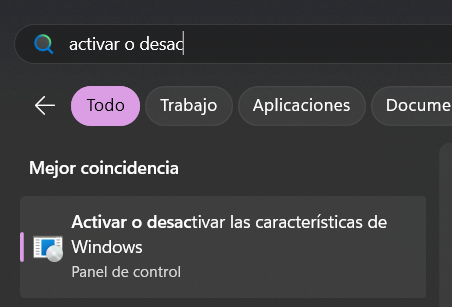

Luego buscaremos la opción: Internet Information Services

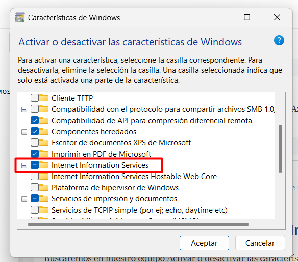

Luego de ya tener los cambios hechos vamos y abrimos el IIS

## Ahora procedemos a clonar el repositorio del Ris

Ya estamos listos para descargar el código de la aplicación.  

> ### Clonar el repositorio en nuestra ubicación deseada en el equipo

En este caso lo haremos en la carpeta Indira que se encuentra ubicada en el escritorio

Abriremos el Git Bash e iremos a nuestra ubicación navegando con 'cd + ruta'

Ahora nos dirigimos al proyecto que está en Azure DevOps, entramos al proyecto que queremos descargar, en este caso Indira-HealthTech -> Indira-Platform, y vamos a la opción Repos -> Files

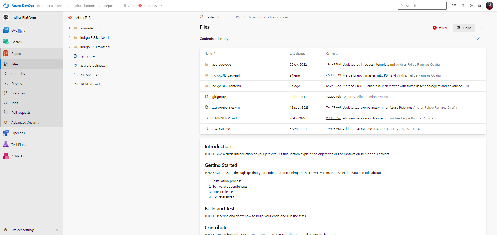

Ahora, damos clic en "Clone" y copiamos la URL

Aquí tienes la url: https://Indira-HealthTech@dev.azure.com/Indira-HealthTech/Indira-Platform/_git/Indira%20RIS

Ahora, usando la consola, escribimos el siguiente comando, después de ejecutar, ya habremos descargado el repositorio

    git clone + url
    
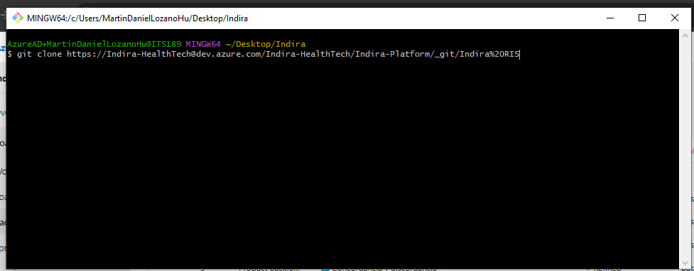

¡Listo! ya tenemos nuestro repositorio descargado. Ahora nos encargamos de configurar los proyectos

### Configuración de nuestro proyecto de servicios (Back-End) en Visual Studio

> ### 1. Abrimos Visual Studio en modo administrador

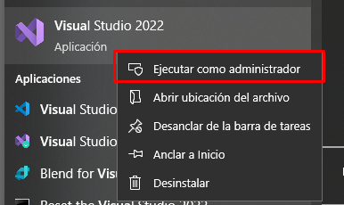

Una vez dentro le daremos en Abrir un proyecto o una Solución e iremos a nuestra carpeta donde hemos clonado el repositorio, dentro le damos a Indigo.RIS.Backend y luego a Indigo.RIS.Backend.sln como en la imagen a continuación:

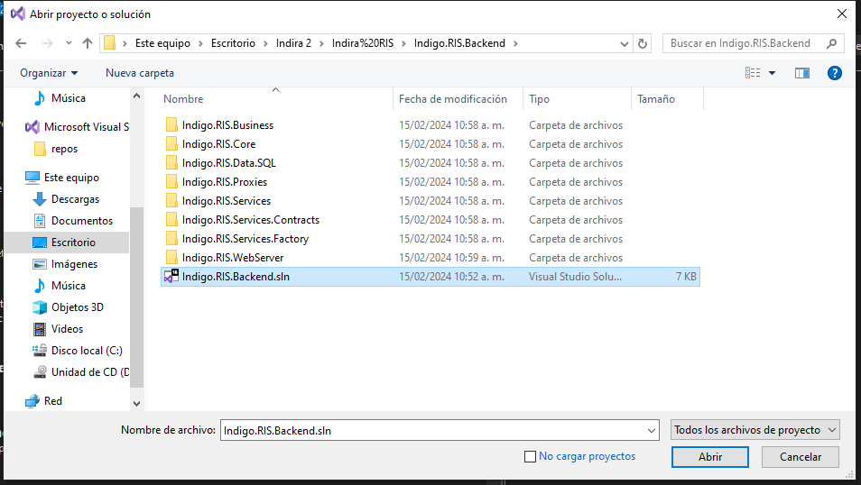

Ya luego de que cargue todo el proyecto le daremos clic derecho a nuestra solución y en Administrar paquetes NuGet, como veremos a continuación en la imagen:

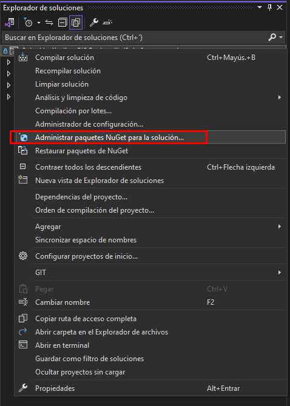

Ahora estando dentro del administrador de paquetes le daremos a restaurar

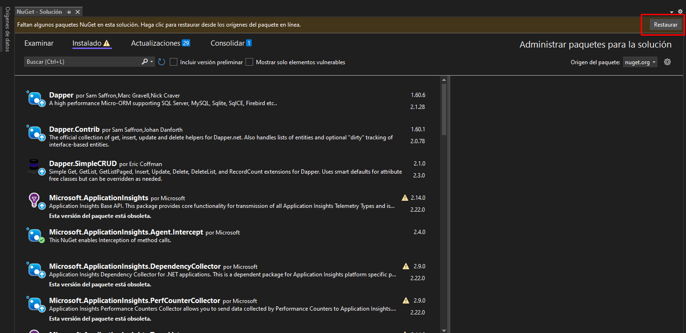

¡Listo! ya tenemos nuestro servicio configurado. Ahora nos encargamos de configurar el servicio en el iis

## Configurando nuestro IIS

Ahora solo nos queda configurar nuestro sitio IIS donde estarán alojados los servicios del RIS. Sigamos con los siguientes pasos.

> ### 1. Crear un nuevo sitio en IIS

Para crear un nuevo sitio, ingresamos al IIS de nuestro equipo

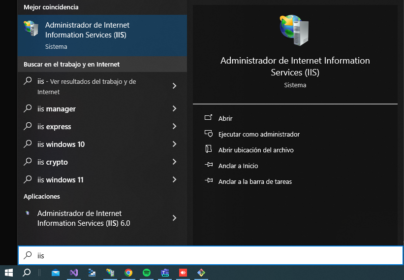

Nos ubicamos sobre el directorio "Sitios", damos clic derecho y seleccionamos "Agregar sitio web"

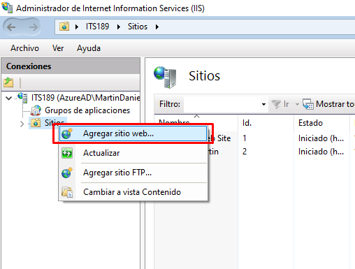 

Lo configuramos como se muestra a continuación:

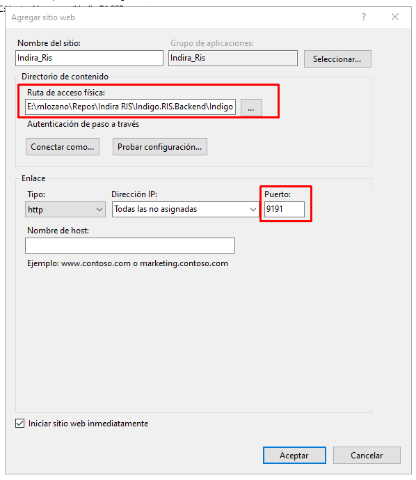

Debemos tener en cuenta que el puerto sea el 9191, en la ruta de acceso física buscaremos nuestra carpeta que se clono el repositorio accedemos a la carpeta Indigo.RIS.Backend -> Indigo.RIS.WebServer y le damos aceptar

> ### 2. Crear una aplicación dentro del sitio en IIS

Nos ubicamos sobre el nuestro Sitio llamado Indira, damos clic derecho y seleccionamos "Agregar Aplicación"

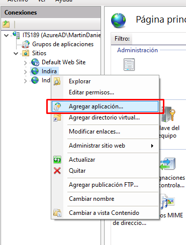

Lo configuramos como se muestra a continuación:

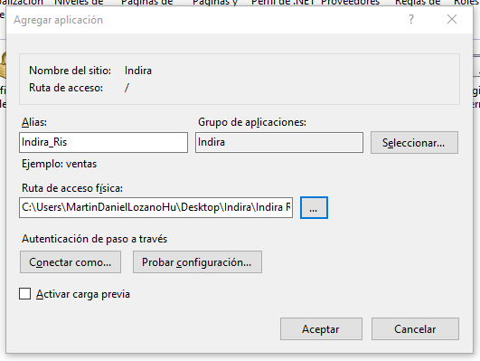

En la ruta de acceso física seguimos los pasos como el paso 1 para agregar la ruta física

> ### 3. Configuración de enlace https

Nos ubicamos sobre el nuestro Sitio llamado Indira, damos clic derecho y seleccionamos "Modificar enlaces"

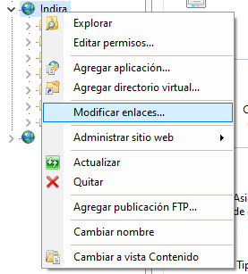

Agregamos un enlace como se muestra a continuación:

**https - puerto 9192**

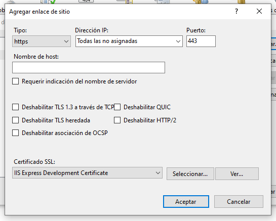

### Ya tenemos el IIS configurado, pero ¿cómo sabemos que nuestro servicio funcionando?

Nos ubicamos sobre nuestro Sitio llamado Indira, al lado derecho en alguno de nuestros 2 puertos que están en "Examinar sitio web" le damos clic

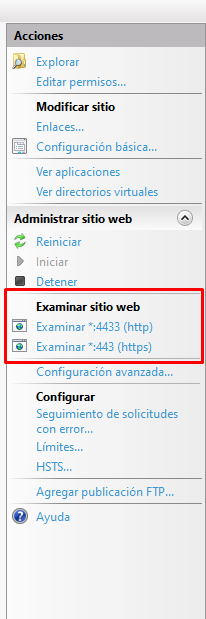

Si cuando se nos abre nuestro navegador y se nos muestra lo siguiente todo va a la perfección hasta este punto:

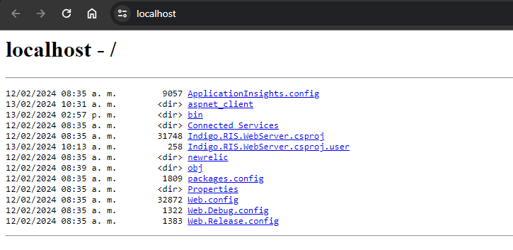

En el caso que os salga un error podeis acceder a este enlace clic [Aquí](enlace) y descargar un rar de los paquetes nuget para el proyecto

Una ves lo descargan y lo descomprimen, lo copiaremos y pegaremos en la siguiente ruta:
Accedemos al disco local C luego usuarios entramos a nuestro usuario y luego en la carpeta .nuget ahí pegaremos nuestra carpeta que descargamos y descomprimimos, en mi caso la ruta es: C:\Users\mlozano\.nuget

### Configuración de nuestro proyecto de la página web (Front-End) en Visual Studio

> ### 1. Abrimos Visual Studio en modo administrador

Una vez dentro le daremos en Abrir un proyecto o una Solución e iremos a nuestra carpeta donde hemos clonado el repositorio, dentro le damos a Indigo.RIS.Frontend y luego a Indigo.RIS.Frontend.sln como en la imagen a continuación:

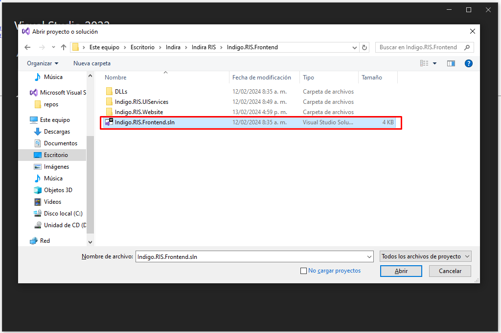
