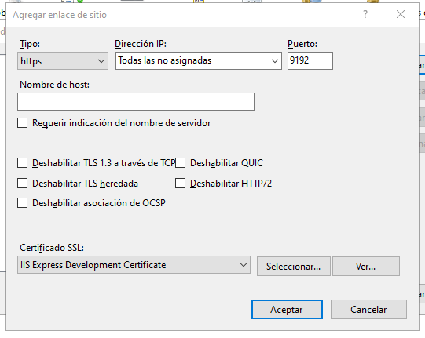

# ¿Que es Indira Ris?

Imagine controlar eficientemente su compañía dando alcance y cumplimiento a los objetivos estratégicos de su organización en una sola herramienta, Indigo Vie es un completo ERP que apoya a las áreas administrativas, financieras y de recursos humanos.  

## Introducción

A continuación, le mostraremos como descargar e instalar las herramientas necesarias para obtener nuestra solución de Indira Ris. también a como configurar nuestro sitio de servicios donde se alojarán los webs services del RIS

#### Prerrequisitos 📋

* [.NET](https://docs.microsoft.com/es-es/dotnet/fundamentals/) - Framework gratuito y de código abierto para los sistemas operativos Windows, Linux y macOS.  Es un sucesor multiplataforma de .NET Framework. Se usa la versión 2.2. [Enlace de Descarga](https://versionsof.net/core/2.2/2.2.8/) 

* DevExpress - herramienta que ofrece unas de las suits más completas de componentes de interfaz de usuario (UI) en todas las plataformas .NET tales como Windows Forms, MVC, ASP.NET, Silverlight y Windows XAML. Se usa la versión 20.1.8

## ¡Comenzamos! 🚀

Para esto debemos descargar el IDE el cual usaremos, llamado [**Visual Studio**](https://visualstudio.microsoft.com/es/downloads/, "Enlace de descarga") en la versión 2022. Luego realizaremos los siguientes pasos:  

> ### 1. Instalaremos visual studio

Cuando estemos en los pasos de instalación, tener en cuenta estas opciones:

**Nota: Importante siempre ejecutar el visual en modo administrador**

> ### 2. Descargaremos e instalaremos GIT

Git es una herramienta que usaremos para el control de versiona miento de producto, para descargarla damos clic [Aquí](https://git-scm.com/download/win) y seguimos los pasos del instalador.  

> ### 3. Descargaremos e instalaremos Azure CLI

Después de descargar GIT, procedemos con Azure CLI. Para ello damos clic [Aqui](https://docs.microsoft.com/en-us/cli/azure/install-azure-cli-windows?tabs=azure-cli) y seguimos los pasos de instalación.  

> ### 4. Agregamos la extensión Azure devops   
Una vez tengamos instalado GIT y Azure CLI, abrimos la consola de comandos de GIT y agregamos el siguiente comando: 

    az extension add --name azure-devops

Luego de esto de agregar la extensión, verificamos la sesión en Azure CLI. Para ellos ejecutamos  

    az login

Se abrirá el navegador pidiéndonos ingresar las credenciales. Se usan las credenciales corporativas (de correo)

> ### 5. Activaremos el IIS (Administrador de Internet Information Services)

Buscaremos en nuestro equipo Activar o desactivar las características de Windows

Luego buscaremos la opción: Internet Information Services

Luego de ya tener los cambios hechos vamos y abrimos el IIS

## Ahora procedemos a clonar el repositorio del Ris 🖇️

Ya estamos listos para descargar el código de la aplicación.  

> ### 1. Clonamos el repositorio en nuestra ubicación deseada en el equipo

En este caso lo haremos en la carpeta Indira que se encuentra ubicada en el escritorio

Abriremos el Git Bash e iremos a nuestra ubicación navegando con 'cd + ruta'

Ahora nos dirigimos al proyecto que está en Azure DevOps, entramos al proyecto que queremos descargar, en este caso Indira-HealthTech -> Indira-Platform, y vamos a la opción Repos -> Files

Ahora, damos clic en "Clone" y copiamos la URL

Aquí tienes la url: https://Indira-HealthTech@dev.azure.com/Indira-HealthTech/Indira-Platform/_git/Indira%20RIS

Ahora, usando la consola, escribimos el siguiente comando, después de ejecutar, ya habremos descargado el repositorio

    git clone + url
    

¡Listo! ya tenemos nuestro repositorio descargado. Ahora nos encargamos de configurar los proyectos

### Configuración de nuestro proyecto de servicios (Back-End) en Visual Studio

> ### 1. Abrimos Visual Studio en modo administrador

Una vez dentro le daremos en Abrir un proyecto o una Solución e iremos a nuestra carpeta donde hemos clonado el repositorio, dentro le damos a Indigo.RIS.Backend y luego a Indigo.RIS.Backend.sln como en la imagen a continuación:

¡[image solution](Images/back_sln.png)

Ya luego de que cargue todo el proyecto le daremos clic derecho a nuestra solucion y en Administrar paquetes NuGet, como veremos a continuación en la imagen:

¡[image Nuget](Images/nuget.png)

Ahora estando dentro del administrador de paquetes le daremos a restaurar:

¡[image Nuget](Images/restore.png)

¡Listo! ya tenemos nuestro servicio configurado. Ahora nos encargamos de configurar el servicio en el iis

## Configurando nuestro IIS

Ahora solo nos queda configurar nuestro sitio IIS donde estarán alojados los servicios del RIS. Sigamos con los siguientes pasos.

> ### 1. Crear un nuevo sitio en IIS

Para crear un nuevo sitio, ingresamos al IIS de nuestro equipo

Nos ubicamos sobre el directorio "Sitios", damos clic derecho y seleccionamos "Agregar sitio web"

 

Lo configuramos como se muestra a continuación:

Debemos tener en cuenta que el puerto sea el 9191, en la ruta de acceso física buscaremos nuestra carpeta que se clono el repositorio accedemos a la carpeta Indigo.RIS.Backend -> Indigo.RIS.WebServer y le damos aceptar

> ### 2. Crear una aplicación dentro del sitio en IIS

Nos ubicamos sobre el nuestro Sitio llamado Indira, damos clic derecho y seleccionamos "Agregar Aplicación"

Lo configuramos como se muestra a continuación:

En la ruta de acceso física seguimos los pasos como el paso 1 para agregar la ruta física

> ### 3. Configuración de enlace https

Nos ubicamos sobre el nuestro Sitio llamado Indira, damos clic derecho y seleccionamos "Modificar enlaces"

Agregamos un enlace como se muestra a continuación:

**https - puerto 9192**

### Ya tenemos el IIS configurado, pero ¿cómo sabemos que nuestro servicio funcionando?

Nos ubicamos sobre nuestro Sitio llamado Indira, al lado derecho en alguno de nuestros 2 puertos que están en "Examinar sitio web" le damos clic

Si cuando se nos abre nuestro navegador y se nos muestra lo siguiente todo va a la perfección hasta este punto:

En el caso que os salga un error podeis acceder a este enlace [Click Aquí](enlace) y descargar un rar de los paquetes nuget para el proyecto

Una ves lo descargan y lo descomprimen, lo copiaremos y pegaremos en la siguiente ruta:
Accedemos al disco local C luego usuarios entramos a nuestro usuario y luego en la carpeta .nuget ahí pegaremos nuestra carpeta que descargamos y descomprimimos, en mi caso la ruta es: C:\Users\mlozano\.nuget

### Configuración de nuestro proyecto de la página web (Front-End) en Visual Studio

> ### 1. Abrimos Visual Studio en modo administrador

Una vez dentro le daremos en Abrir un proyecto o una Solución e iremos a nuestra carpeta donde hemos clonado el repositorio, dentro le damos a Indigo.RIS.Frontend y luego a Indigo.RIS.Frontend.sln como en la imagen a continuación:

¡[image solution](Images/front_sln.png)
